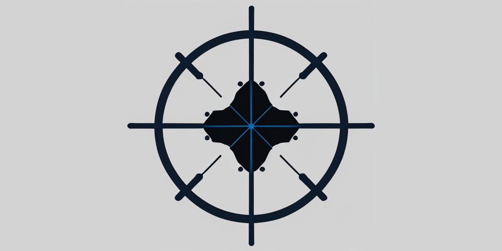

    <h1>Goraph</h1>
    

# Goraph: A Go-Language-Based AI Library Built on Computational Graphs

Goraph is a newly developed artificial intelligence library entirely written in Go language, utilizing advanced computational graph technology to build and train machine learning models. Designed to provide high-performance, user-friendly, and scalable deep learning tools, Goraph takes full advantage of the concurrency and simplicity of the Go language.

**Please note that it is currently an experimental project under development and not suitable for production use.**
